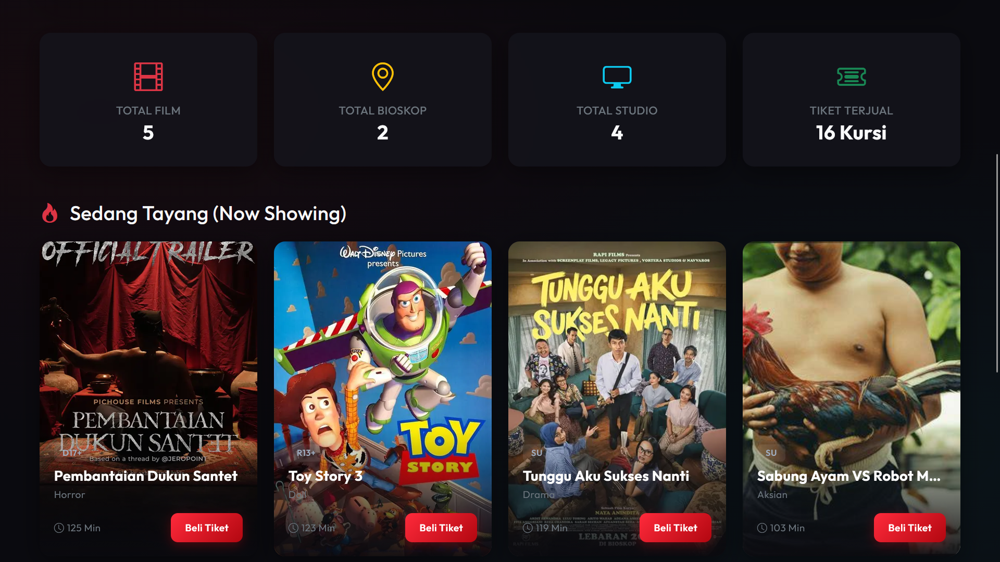
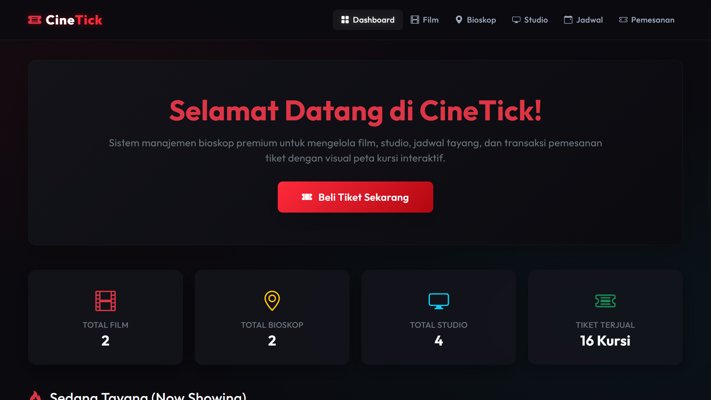
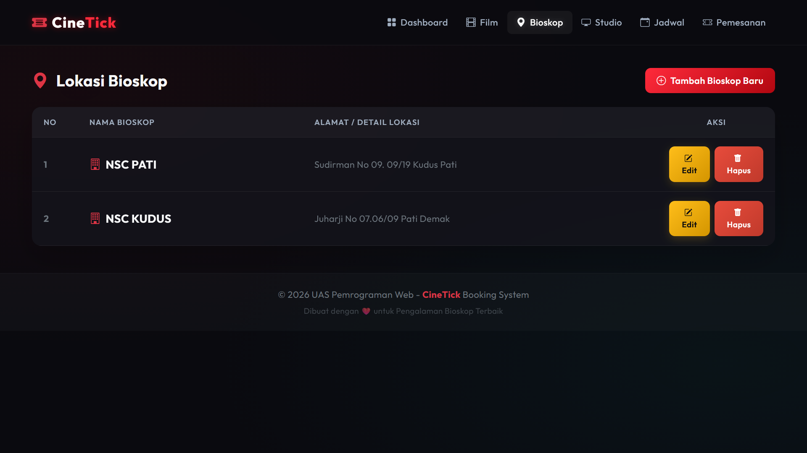
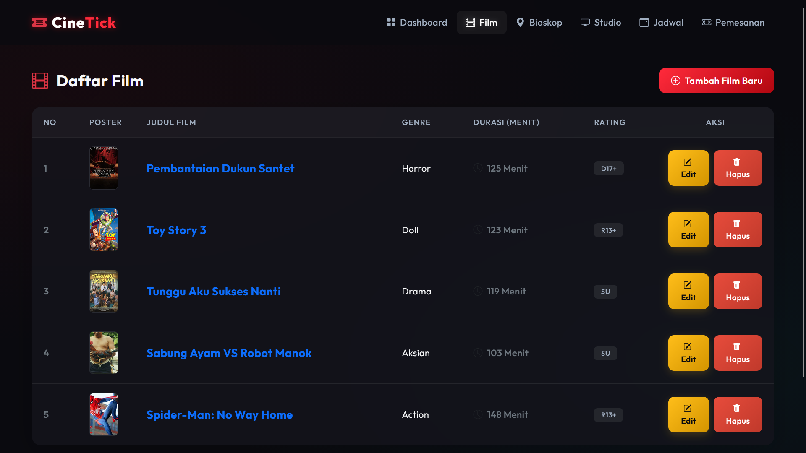
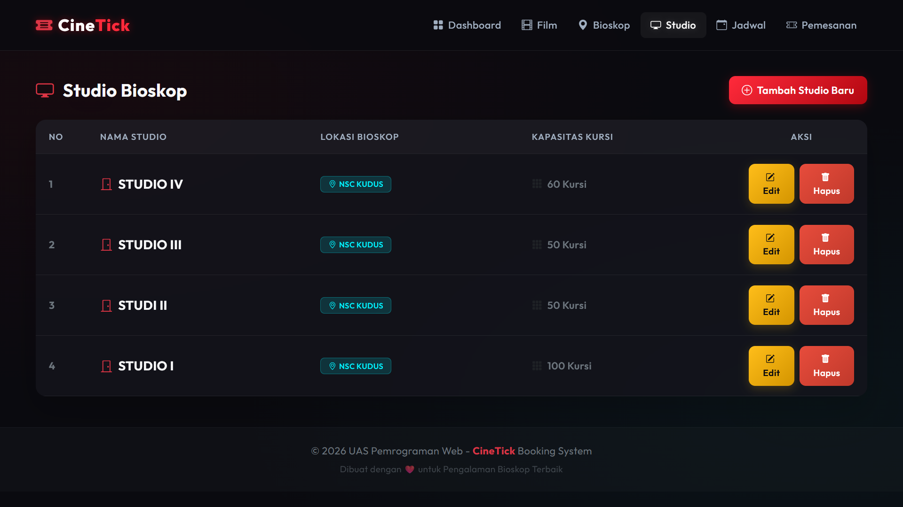
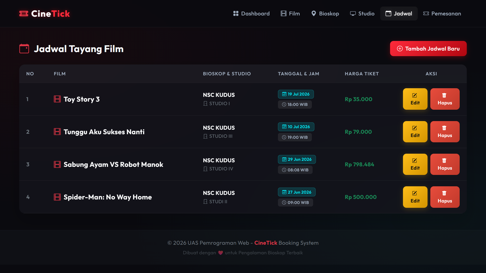
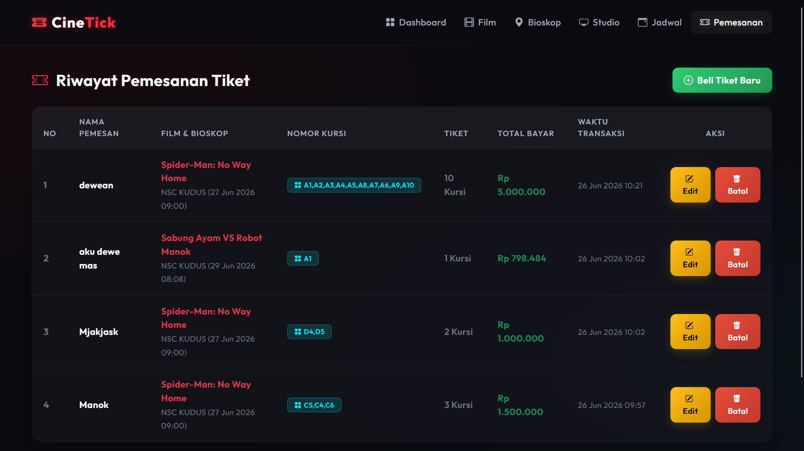
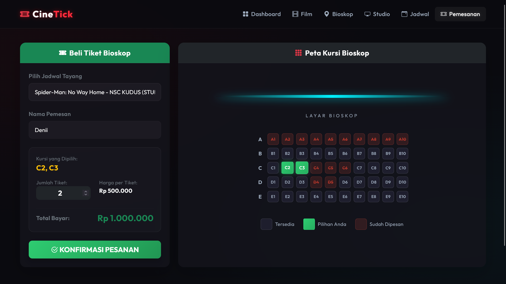

# 🎬 Cinema Booking System


A web-based **Cinema Booking System** developed using **Native PHP** and **MySQL**. This application provides complete management of cinemas, movies, studios, schedules, and ticket bookings through a responsive web interface.

---

# ✨ Features

- 🎬 Movie Management (CRUD)
- 🏢 Cinema Management (CRUD)
- 🎭 Studio Management (CRUD)
- 📅 Schedule Management (CRUD)
- 🎟️ Booking Management (CRUD)
- 📱 Responsive User Interface

---

# 🛠️ Tech Stack

| Technology | Description |
|------------|-------------|
| PHP | Native PHP |
| Database | MySQL |
| Frontend | HTML5, CSS3 |
| UI Framework | Bootstrap |
| Programming | JavaScript |

---

# 📸 Application Preview

## 🏠 Home Page



---

## 📊 Dashboard



---

## 🏢 Cinema Management



---

## 🎬 Movie Management



---

## 🎭 Studio Management



---

## 📅 Schedule Management



---

## 🎟️ Booking Management



---

## ➕ Booking Form



---

# 🎥 Demo Video

Click the link below to watch the application demo.

▶️ https://drive.google.com/file/d/105oqu3LPJWDt0isu7Rqa8wqE6O33_Utm/view

---

# 🚀 Installation

### 1 Clone Repository

```bash
git clone https://github.com/denikurniii3/cinema-booking-system-native-php.git
```

### 2 Move Project

Copy the project into

```
htdocs/
```

### 3 Import Database

Import

```
database/db_bioskop.sql
```

using phpMyAdmin.

### 4 Configure Database

Edit

```
koneksi.php
```

according to your local database configuration.

### 5 Start XAMPP

- Apache
- MySQL

### 6 Run Project

```
http://localhost/cinema-booking-system-native-php
```

---

# 📂 Project Structure

```
cinema-booking-system-native-php
│
├── assets/
├── css/
├── database/
├── screenshots/
├── booking_*.php
├── cinema_*.php
├── movie_*.php
├── studio_*.php
├── jadwal_*.php
├── header.php
├── footer.php
├── koneksi.php
└── index.php
```

---

# 📈 Future Improvements

- Login Authentication
- Search & Filter
- Pagination
- Seat Selection
- Payment Gateway
- Online Ticket QR Code
- User Dashboard

---

# 👨‍💻 Author

**Deni Kurniawan**

Information Systems Student

Universitas Muria Kudus

GitHub

https://github.com/denikurniii3

---

# ⭐ Support

If you like this project, don't forget to give this repository a ⭐ on GitHub.